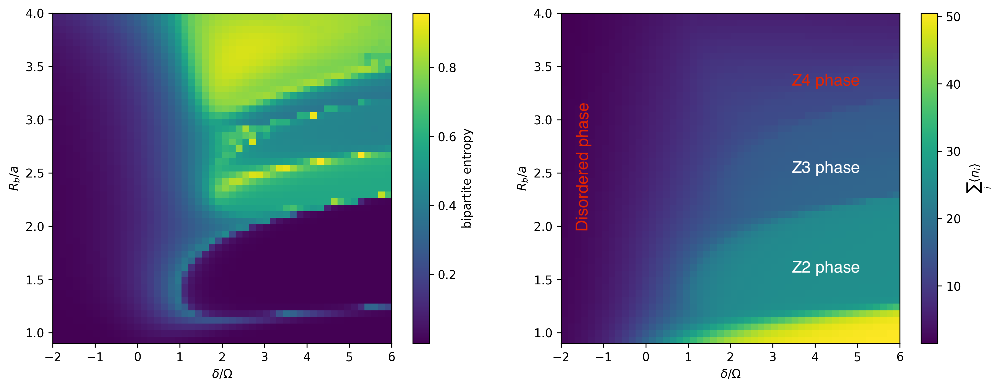

# Quantum Phase Classification

## 🚀 FLIQ (Future Leaders in Quantum) 2025 Hackathon Submission  
**Track:** Science | **Challenge:** Classiq x DuQIS | **Hosted by:** Classiq Technologies & Duke Quantum Information Society

---

## 🏆 Overview

This repository contains our winning 1st prize submission for the **FLIQ 2025 Classiq x DuQIS Quantum Machine Learning Challenge**, where we built a **Quantum Machine Learning (QML)** model to classify **quantum phases of matter** — specifically distinguishing between the **Z2** and **Z3** ordered phases in a **Rydberg atom chain**.

> **Note**: Please consider `Version 2` as a secondary solution. It explores an alternate model but is less refined and should not be considered the primary solution.

---

## 🧩 Problem Overview

Design a **Quantum Machine Learning (QML)** model to classify phases of quantum matter using **classical shadows** derived from randomized measurements of a **Rydberg atom system**.

- Input: Measurement outcomes encoded as Pauli-basis classical shadows.
- Output: Predict the **phase label** (`Z2` or `Z3`) of the quantum state.
- Constraint: Avoid reconstructing the full quantum state (no full $\rho$).

---
## 🌀 Rydberg Atom Phase Diagram

This phase diagram shows the regions corresponding to the different ordered quantum phases studied in this challenge (`Z2` and `Z3`).


---
## 🧠 Our Solution

We developed a QML pipeline using **reduced density matrices** and a **parameterized quantum circuit** trained to distinguish between the two phases.

### ✅ Key Features
- **Encoding:** Custom angle encoding of reduced observables.
- **Architecture:** Shallow quantum circuit optimized for width and depth.
- **Inference:** Hybrid quantum-classical optimization loop.
- **Efficiency:** Tuned to minimize parameters, depth, and qubits, as per the scoring function.

> ℹ️ **Note:** Please refer to `version_2/` for an alternate (experimental) architecture we explored.

---

## 🧪 Dataset Details

- Each sample: $T = 500$ randomized measurements of an $n = 51$ qubit state.
- Measurements: From $\{ |g\rangle, |r\rangle, |+\rangle, |-\rangle, |+i\rangle, |-i\rangle \}$
- Label: Phase category (`Z2`, `Z3`)

---

## 🛠 Repository Structure

```bash
.
├── FLIQ_Challenge_ClassiqDuQIS.ipynb  # Main solution notebook
├── version_2/                         # Secondary model (not primary)
│   └── alternate_model.ipynb
├── training_data.npz                 # Provided measurement data
├── phase_diagram.png                 # Reference for Rydberg phases
├── qprog.qprog                       # Saved quantum program
└── trained_model_params.npz         # Optimized model parameters
```


## 📊 Evaluation Metric

The scoring function used in the challenge is:

\[
f(A, P, D, W) = A - 0.1P - 0.0002D - 0.1W
\]

Where:

- **A**: Accuracy on the test set  
- **P**: Number of trainable parameters  
- **D**: Circuit depth  
- **W**: Number of qubits (circuit width)

We optimized our model to **maximize accuracy** while keeping the number of parameters (**P**), depth (**D**), and width (**W**) as low as possible to achieve a high score.

---

## 📚 References

- Huang et al., *Predicting Many Properties of a Quantum System from Very Few Measurements*, [arXiv:2002.08953](https://arxiv.org/abs/2002.08953)  
- Huang et al., *Provably Efficient Machine Learning for Quantum Many-Body Problems*, [arXiv:2106.12627](https://arxiv.org/abs/2106.12627)  
- Sim et al., *Expressibility and Entangling Capability of Parameterized Quantum Circuits*, [arXiv:1905.10876](https://arxiv.org/abs/1905.10876)  
- [Bloqade.jl — Rydberg Atom Simulations](https://queracomputing.github.io/Bloqade.jl/stable/tutorials/1.blockade/main/)

---

## 🧑‍💻 Team

**Team Name:** MerQury  
**Event:** [FLIQ 2025 Hackathon](https://www.quantumcoalition.io/fliq)  
**Track:** Science — Classiq x DuQIS Quantum Phase Classification  
**Submission:** Primary model in root, alternate version in `version_2/`

## Challenge Statement
https://github.com/dmitriikhitrin/Classiq-x-DuQIS-FLIQ-Challenge

##This repository is a collaborative work originally started by @Hemishahuja. I contributed to this project and uploaded it here for personal portfolio and archiving purposes.
